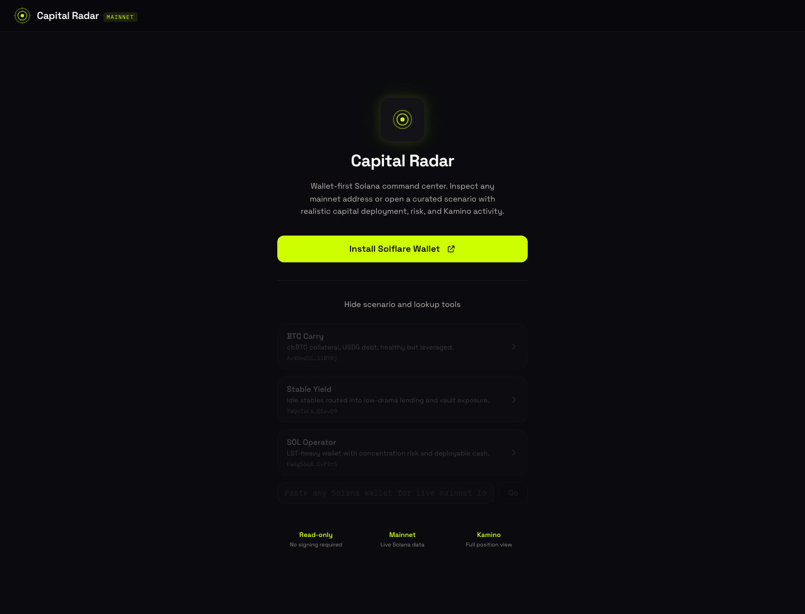
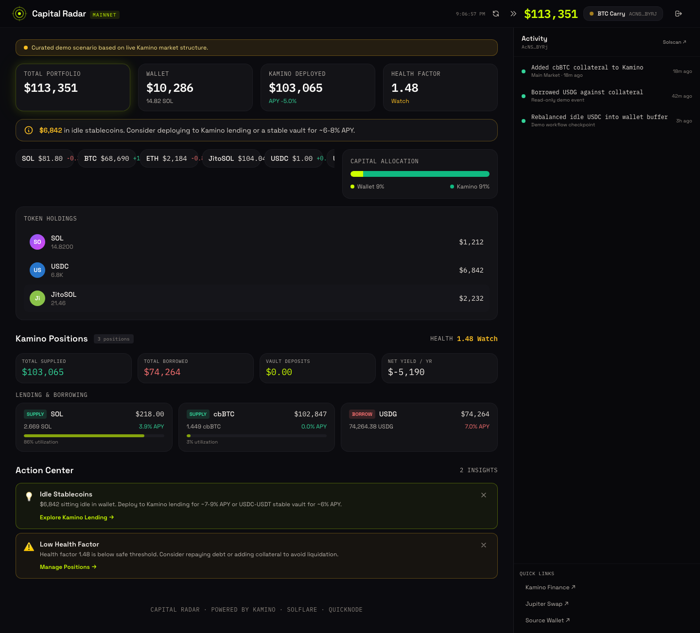
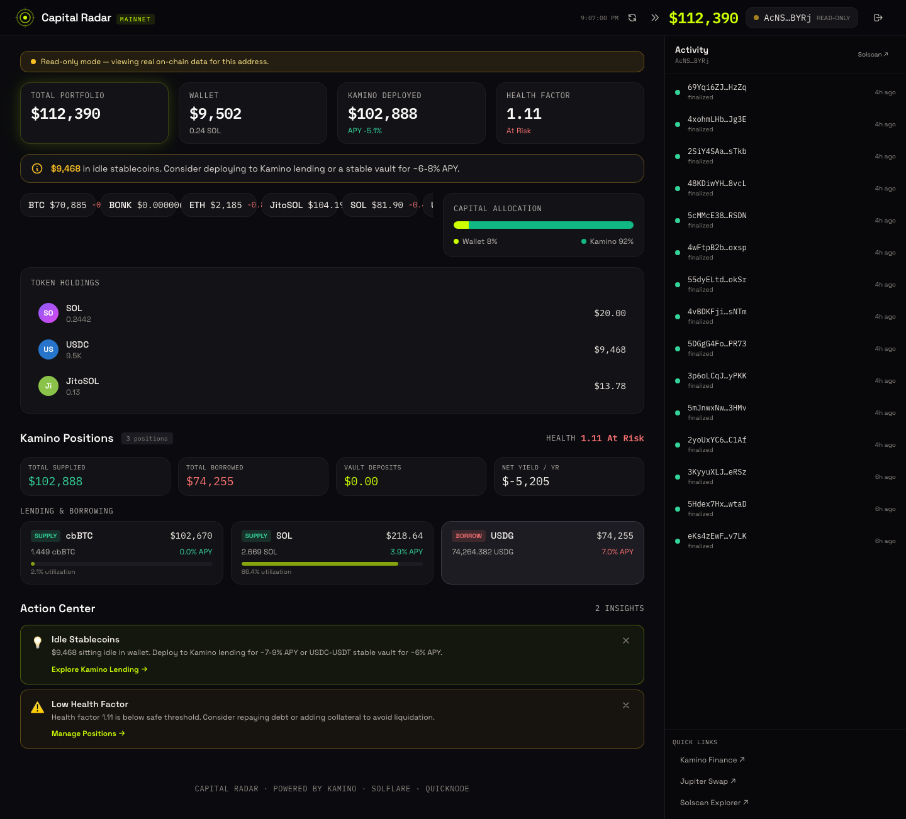

# Capital Radar

Capital Radar is a wallet-native Solana operator desk built for the Eitherway Frontier track. It turns a wallet into an action surface: live balances, recent activity, Kamino exposure, health factor, and next-step prompts in one view.

The app supports two modes:

- live read-only inspection for any Solana address
- curated portfolio scenarios that show the full product surface without relying on a perfect demo wallet

## Live links

- Live dApp: https://capital-radar.netlify.app/
- Eitherway preview: https://preview.eitherway.ai/d0a73a02-0d91-4e66-9afe-6e31ecaa4eef/

## What it does

- Solflare-first wallet entry with fallback install prompt
- read-only wallet inspection for any mainnet address
- wallet value, deployed capital, and health-factor overview
- Kamino lending and borrow position parsing
- action center for idle capital and risk prompts
- activity rail with recent signatures and protocol links
- mobile-friendly layout with a dedicated side rail toggle

## Partner stack

- `Solflare` for wallet-first onboarding and connection flow
- `Kamino` for productive-capital and risk context
- `QuickNode` for live Solana RPC reads

## Screens







## Local development

```bash
cd /Users/frederikbussler/competition-submissions/eitherway-capital-radar
npm install
npm run dev
```

Build for production:

```bash
npm run build
```

## Environment

Copy `.env.example` to `.env` if you want to override the default RPC or proxy base URL.

## Repo layout

- `src/` React app source
- `assets/` screenshots for submission and docs
- `docs/PARTNER_INTEGRATION.md` implementation notes for the track

## Notes

The default setup ships with a browser-safe QuickNode Solana endpoint and an env override so the deployment can be pointed at a dedicated QuickNode URL later without changing application code.
