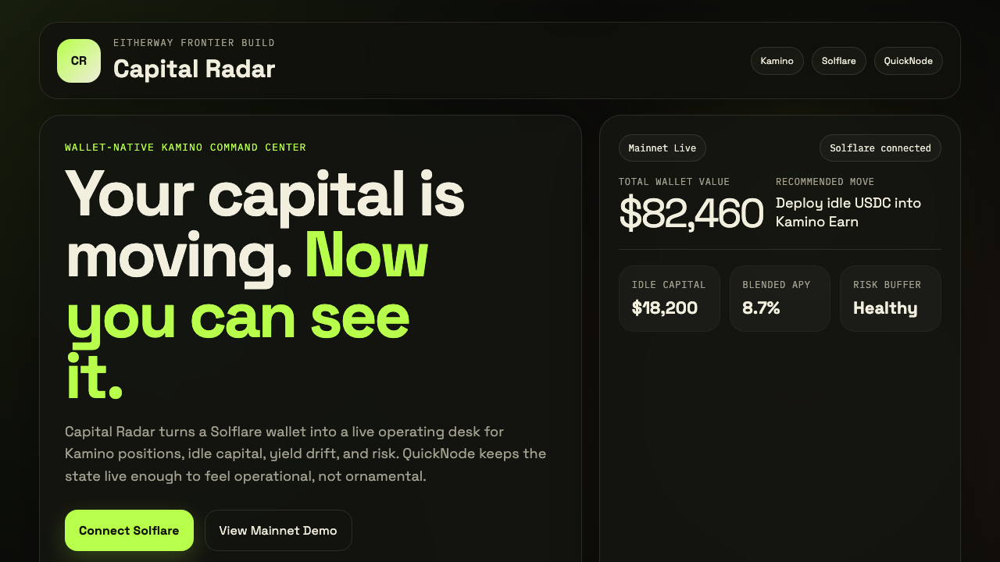

# Capital Radar

Capital Radar is a wallet-native operating desk for Solana users managing productive capital on Kamino.

Most portfolio tools show balances. Capital Radar is designed to answer the questions that actually matter when a wallet is active onchain:

1. What is my wallet doing right now?
2. How much of my capital is actually productive?
3. Where is my Kamino risk creeping up?
4. What is the next action worth taking?

The product turns a Solflare wallet into that operating surface. Kamino is the core engine for yield and position management, QuickNode provides the low-latency live state layer, and Solflare is treated as the primary interface for wallet actions instead of a generic connect button.

## Core experience

- wallet balance and idle capital
- Kamino earn and borrow positions
- liquidation buffer and health signals
- live activity feed and transaction status
- suggested next actions such as deposit, repay, rebalance, or unwind
- transaction preview before signature

## Partner stack

- `Kamino` for the capital layer and position logic
- `Solflare` for wallet-first onboarding and signing flows
- `QuickNode` for responsive reads and live state updates

## Live links

- Live dApp: https://capital-radar.netlify.app/
- Eitherway preview: https://preview.eitherway.ai/d0a73a02-0d91-4e66-9afe-6e31ecaa4eef/
- Demo video: https://github.com/frederik-maker/eitherway-capital-radar/releases/download/submission-assets-v1/capital-radar-demo-final.mp4

## Visual preview



## Repository structure

- `prototype/` reference interface for product direction and demo planning
- `assets/` screenshots used in documentation
- `docs/PARTNER_INTEGRATION.md` notes on how the partner stack is used in the product

## Local prototype

Open `prototype/index.html` in a browser or serve the folder with:

```bash
cd /Users/frederikbussler/competition-submissions/eitherway-capital-radar/prototype
python3 -m http.server 8080
```

Then visit `http://localhost:8080`.

## Notes

The production deployment is intended to run as a public Solana dApp. This repository contains the reference interface, screenshots, and partner integration notes used during development.
